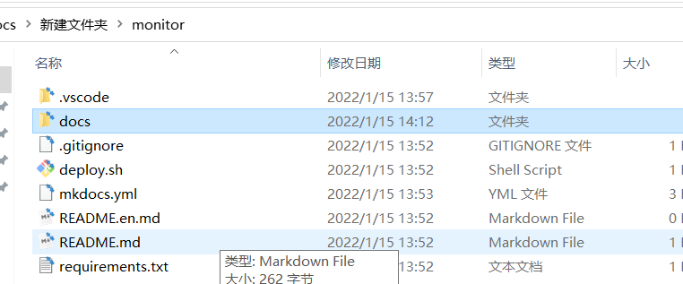
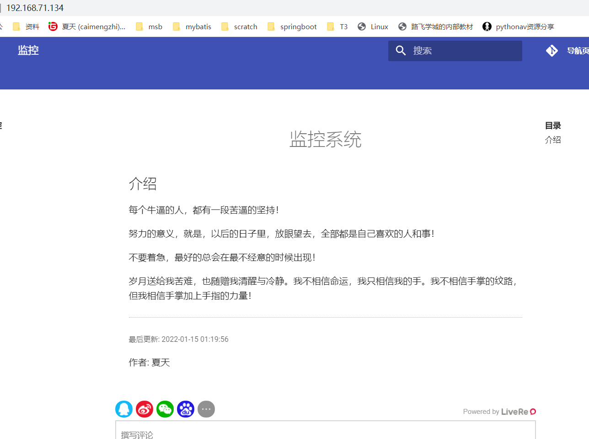
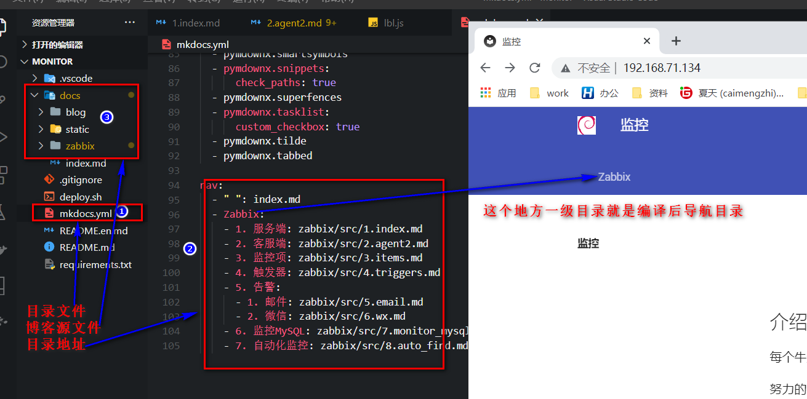
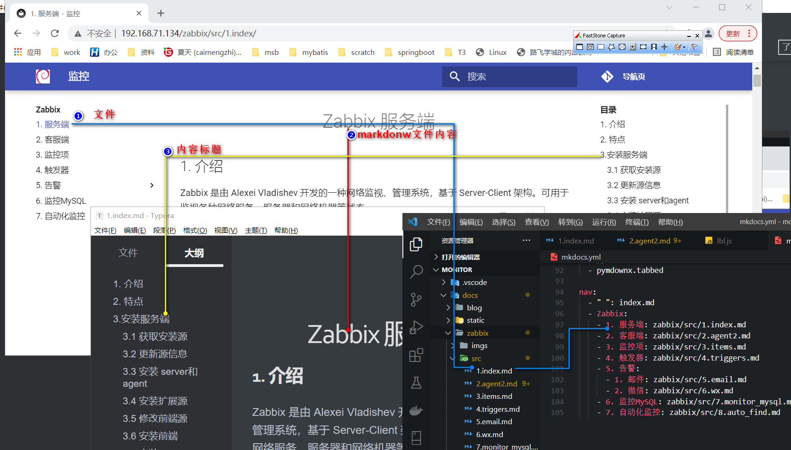

<center><h1>博客</h1></center>

## 1. 介绍

在我们学习的时候整理一套自己的笔记非常的重要，日后面试找工作的时候写在简历上是一个亮点。为了能够让你更快学会，其实记录的博客有很多种，比如云雀，有道云等，我接下来介绍我一直使用的博客软件`mkdocs`。

在开始直接我大致介绍一下基于`mkdocs`写的纯静态博客的大致步骤

- 创建虚拟环境[mkdocs是python写的]
- 改mkdocs模板
- 写博客内容
- 编译安装
- 结合Nginx解析

## 2. 操作流程

### 2.1 创建虚拟环境

我使用的虚拟机，python环境是3.6，先安装虚拟环境的软件。

```
[root@node2 ~]# pip3 install virtualenvwrapper  
[root@node2 ~]# virtualenv --version
virtualenv 20.4.7 from /usr/local/lib/python3.6/site-packages/virtualenv/__init__.py
```

> 这样出现上面就表示安装成功。

在开始之前，我已经给你分享好我做的`mkdocs`的模板。



把这个文件上传到自己虚拟机。压缩拖拽到虚拟机即可。

```
[root@node2 ~]# tree . -L 2
.
└── monitor
    ├── deploy.sh
    ├── docs
    ├── env
    ├── mkdocs.yml
    ├── README.en.md
    ├── README.md
    └── requirements.txt

3 directories, 5 files
```

> 上传到虚拟机位置随便在哪里。看你心情。我是放在/root下。此时你最好使用root权限去操作。

```
[root@node2 monitor]# ls
deploy.sh  docs  env  mkdocs.yml  README.en.md  README.md  requirements.txt

# 创建虚拟机环境
[root@node2 monitor]# ls
deploy.sh  docs    mkdocs.yml  README.en.md  README.md  requirements.txt
[root@node2 monitor]# virtualenv env
[root@node2 monitor]# ls
deploy.sh  docs  env  mkdocs.yml  README.en.md  README.md  requirements.txt

# 进入虚拟环境
[root@node2 monitor]# ls
deploy.sh  docs  env  mkdocs.yml  README.en.md  README.md  requirements.txt
[root@node2 monitor]# source env/bin/activate
(env) [root@node2 monitor]# ls
deploy.sh  docs  env  mkdocs.yml  README.en.md  README.md  requirements.txt

# 安装依赖库 【等等，这个时间有点长】
(env) [root@node2 monitor]# pip install -r requirements.txt  
	
(env) [root@node2 monitor]# mkdocs -V
mkdocs, version 1.2.3 from /root/monitor/env/lib/python3.6/site-packages/mkdocs (Python 3.6)
```

### 2.2 编译源文件

```
初始化仓库
(env) [root@node2 monitor]# git init .  
Initialized empty Git repository in /root/monitor/.git/
(env) [root@node2 monitor]# git add .
(env) [root@node2 monitor]# git commit -am "init"

(env) [root@node2 monitor]# mkdocs build
INFO     -  Cleaning site directory
INFO     -  Building documentation to directory: /root/monitor/site
INFO     -  Documentation built in 1.00 seconds
(env) [root@node2 monitor]# ls
deploy.sh  docs  env  mkdocs.yml  README.en.md  README.md  requirements.txt  site
编译完毕后会出现一个site目录，以后这个目录就nginx解析即可
```

### 2.3 结合nginx

- 安装nginx

```
(env) [root@node2 monitor]# yum install -y nginx
```

- 解析到nginx

  指定解析地址

  ```
  root         /root/monitor/site/;
  ```

  完整配置

```
(env) [root@node2 nginx]# egrep -v '#|^$' nginx.conf
user root;
worker_processes auto;
error_log /var/log/nginx/error.log;
pid /run/nginx.pid;
include /usr/share/nginx/modules/*.conf;
events {
    worker_connections 1024;
}
http {
    log_format  main  '$remote_addr - $remote_user [$time_local] "$request" '
                      '$status $body_bytes_sent "$http_referer" '
                      '"$http_user_agent" "$http_x_forwarded_for"';
    access_log  /var/log/nginx/access.log  main;
    sendfile            on;
    tcp_nopush          on;
    tcp_nodelay         on;
    keepalive_timeout   65;
    types_hash_max_size 4096;
    include             /etc/nginx/mime.types;
    default_type        application/octet-stream;
    include /etc/nginx/conf.d/*.conf;
    server {
        listen       80;
        listen       [::]:80;
        server_name  _;
        root         /root/monitor/site/;
        include /etc/nginx/default.d/*.conf;
        error_page 404 /404.html;
        location = /404.html {
        }
        error_page 500 502 503 504 /50x.html;
        location = /50x.html {
        }
    }
}
```

- 重新加载

```
(env) [root@node2 nginx]# nginx -t # 检查nginx配置文件是否错误
nginx: the configuration file /etc/nginx/nginx.conf syntax is ok
nginx: configuration file /etc/nginx/nginx.conf test is successful
(env) [root@node2 nginx]# nginx   # 启动nginx，第一次才需要
(env) [root@node2 nginx]# nginx -s reload  # 重新加载配置文件
```

- 浏览器访问



以上就是`mkdocs`+`nginx`的整个流程操作流程

## 3. 步骤解析

接下来就是开始述说以下几点：

1. 博客模板解释
2. 如何写文档

### 3.1 模板文件

我用vscode打开模板文件。一一解释





### 3.2 网络文档目录

我们在查看网页的时候。博客左边的目录是怎么调试的？就是我我们在mkdocs.yml中定义的nav下面的数据

### 3.3 博客内容

博客内容使用的markdonw语法。